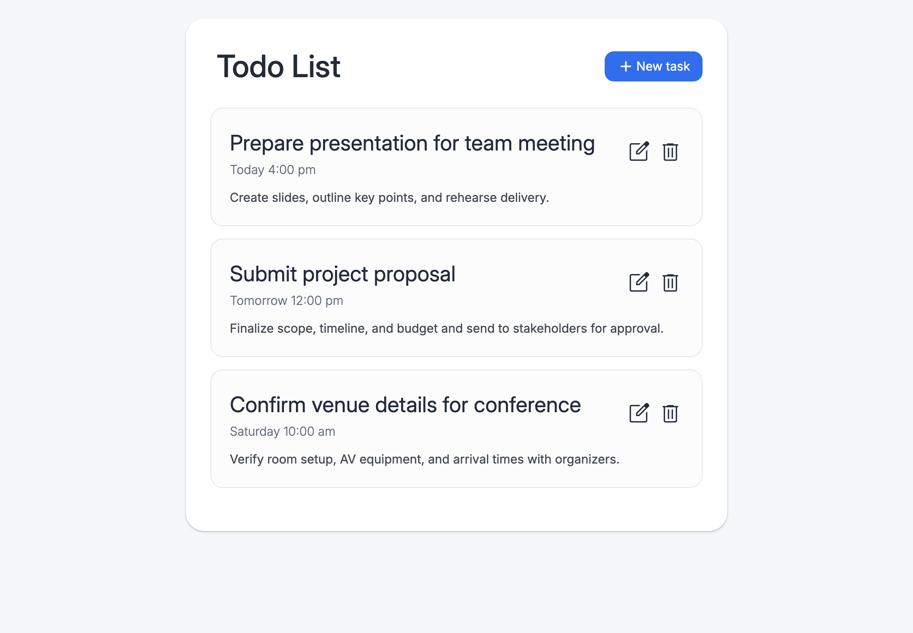
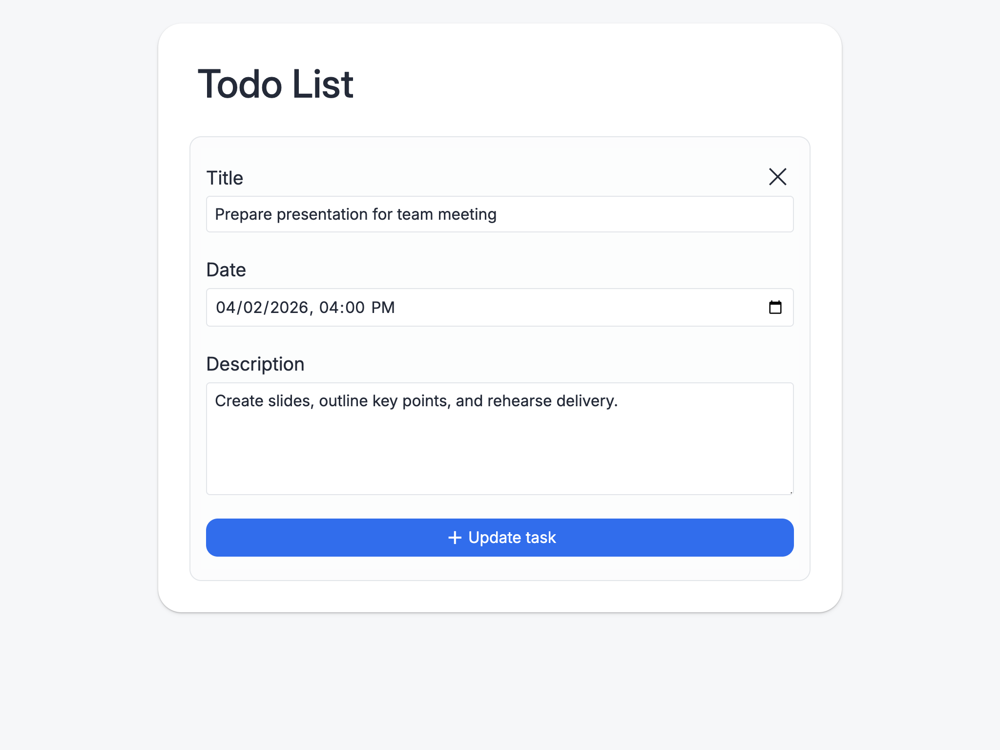
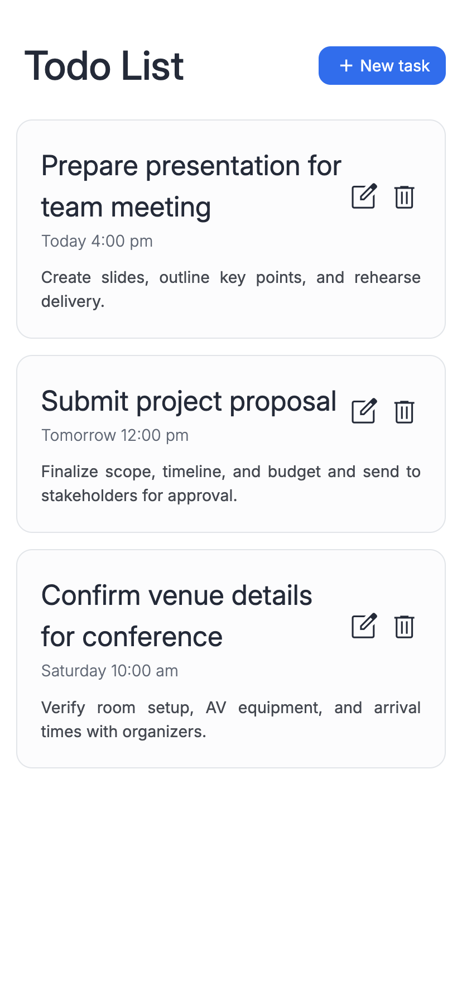
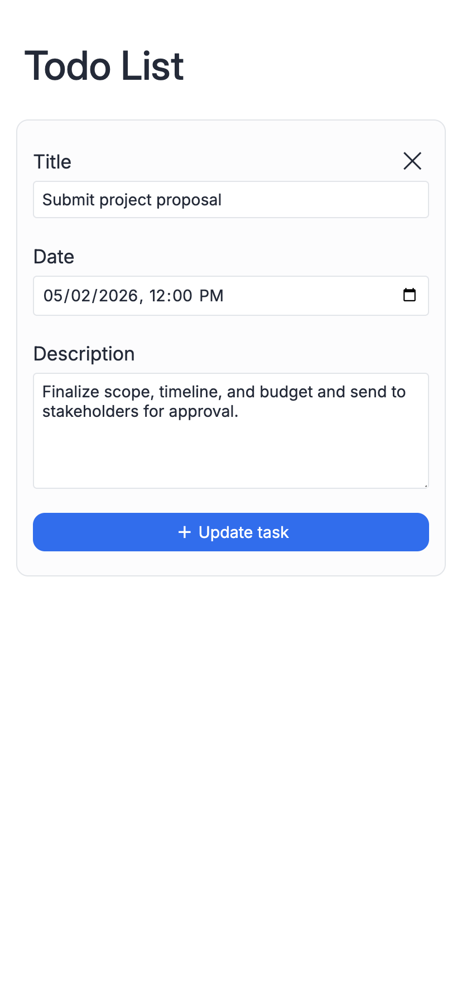
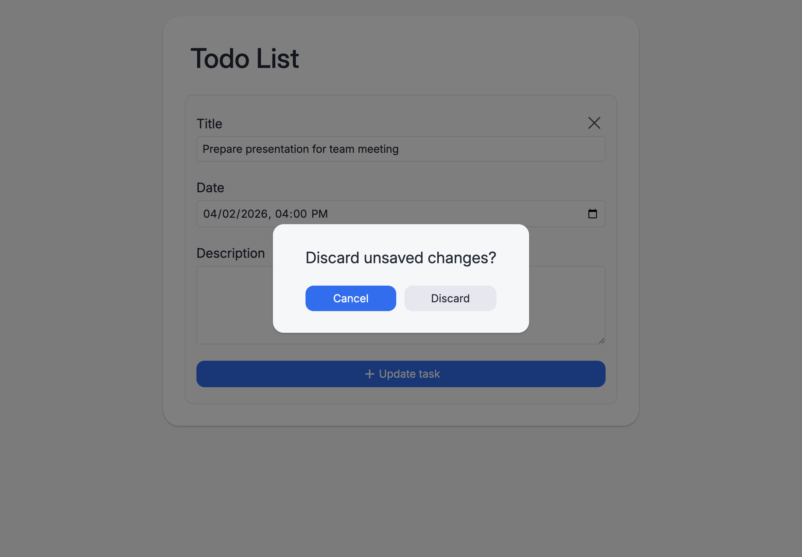

# 📝 Todo List

A simple, clean, and responsive **Todo List web app** built with vanilla HTML, CSS, and JavaScript. Tasks are stored locally in the browser, so your list sticks around even after a refresh.

## ✨ Features

- Add, edit, and delete tasks
- Optional due date & time for each task
- Tasks automatically sorted by date
- Data persisted using `localStorage`
- Responsive, modern UI with smooth interactions

## 🛠️ Built With

- **HTML5** – semantic structure
- **CSS3** – custom properties, responsive layout, and modern styling
- **JavaScript (Vanilla)** – no frameworks, no dependencies
- **LocalStorage API** – client-side persistence
- **Material Symbols** for icons

## 🧪 Images

